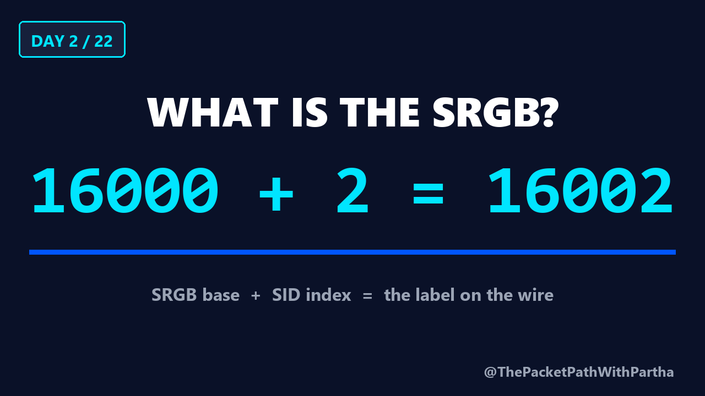
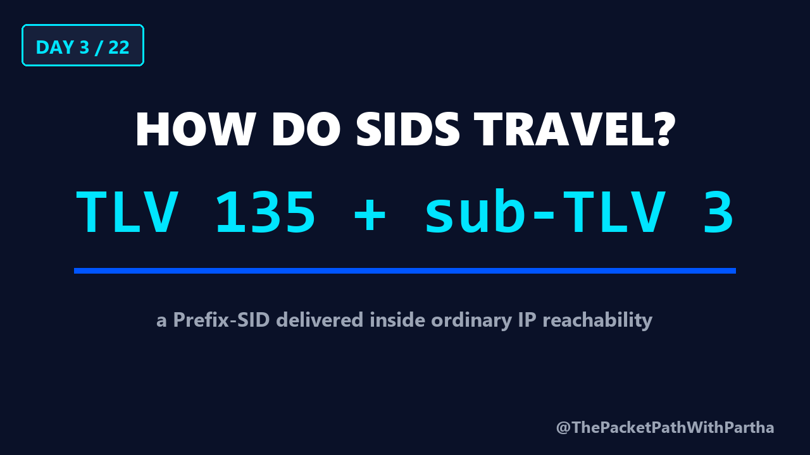
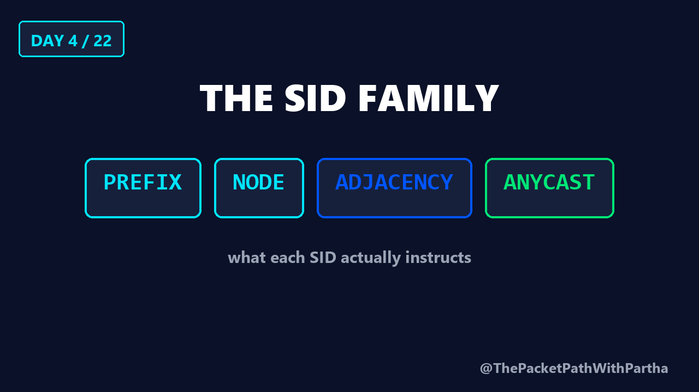

# SR-MPLS Learning Journey

A 22-day video course on **Segment Routing over the MPLS data plane**, taking a
network engineer from *why Segment Routing exists* through to designing,
migrating and troubleshooting a production SR core.

Created and presented by **Enam Ahmed** — [The Packet Path With Partha](https://www.youtube.com/@ThePacketPathWithPartha).

> **Watch on YouTube.** GitHub does not stream video — the files in `videos/`
> download rather than play. The YouTube links below are the intended way to
> watch, and include chapters, captions and the full descriptions.

📺 **[Full playlist →](https://www.youtube.com/playlist?list=PLYQHPRJxy5xk)**
🔔 **[Subscribe →](https://www.youtube.com/@ThePacketPathWithPartha?sub_confirmation=1)**
📘 **[Facebook page →](https://www.facebook.com/ThePacketPathWithPartha)**

---

## Episodes

### Day 1 — Why Segment Routing?
*From protocol complexity to source-routed simplicity*

Why Segment Routing simplifies the MPLS control plane. Contrasts traditional
MPLS using an IGP with LDP and RSVP-TE against the SR-MPLS source-routing
model, and introduces Segment Identifiers, Prefix-SIDs, Adjacency-SIDs, the
head-end concept, and the unchanged MPLS data plane.

▶ [Watch on YouTube](https://www.youtube.com/watch?v=eDqwu6q8Vrc) · 15:22 ·
[`videos/Day01_Why_Segment_Routing.mp4`](videos/Day01_Why_Segment_Routing.mp4)

---

### Day 2 — What Is the SRGB?
*SID index, label arithmetic, and the block every router reserves*

The Segment Routing Global Block, and the arithmetic behind every SR label:

```
label = SRGB base + SID index
16000  +  2       = 16002
```

Covers why LDP's locally-significant labels carry no meaning beyond one link,
the critical distinction between the **globally significant SID index** and the
**locally computed label**, and a walkthrough where one router deliberately uses
a different SRGB base — showing why forwarding still works.

▶ [Watch on YouTube](https://youtu.be/1CZ7QkoUPV0) · 12:24 ·
[`videos/Day02_What_Is_the_SRGB.mp4`](videos/Day02_What_Is_the_SRGB.mp4)



---

### Day 3 — How SIDs Travel
*The IS-IS and OSPF extensions that carry Segment Routing*

How SR capability and SIDs are flooded by the IGP — and why neither IS-IS nor
OSPF needed a redesign to carry them.

**IS-IS carriers**
| Carrier | Sub-TLV |
|---|---|
| Router Capability TLV 242 | SR Capability sub-TLV 2 (the SRGB) |
| Extended IP Reachability TLV 135 | Prefix-SID sub-TLV 3 |
| Extended IS Reachability TLV 22 | Adjacency-SID sub-TLV 31 |
| SID/Label Binding TLV 149 | used by the Mapping Server |

**OSPF carriers**
| Carrier | Contents |
|---|---|
| Router Information Opaque LSA | SR-Algorithm TLV 8, SID/Label Range TLV 9 |
| Extended Prefix Opaque LSA (type 7) | Prefix-SID sub-TLV 2 |
| Extended Link Opaque LSA (type 8) | Adjacency-SID sub-TLV 2 |

▶ [Watch on YouTube](https://youtu.be/FA196yiaYzo) · 12:40 ·
[`videos/Day03_How_Do_SIDs_Travel.mp4`](videos/Day03_How_Do_SIDs_Travel.mp4)



---

### Day 4 — The SID Family
*Prefix, Node, Adjacency and Anycast — what each one instructs*

Four names used almost interchangeably in conversation, and each encoded
differently. A **Prefix-SID** is globally significant and travels as an SRGB
index; an **Adjacency-SID** is locally significant, travels as an absolute
label, and is allocated automatically when an adjacency comes up.

Covers the flag bits with their real IOS XR defaults — **N** (Node-SID, set by
default), **P / NP** (no-PHP), **E** (Explicit-Null, so MPLS EXP/TC bits survive
the final hop) — and how OSPF's different bit layout maps one-to-one onto
IS-IS's.

Closes on the **Anycast-SID**: two routers advertising the same SID on purpose,
giving coarse traffic engineering and automatic failover with no policy change.
The requirement — every node sharing it must use the same SRGB.

▶ [Watch on YouTube](https://youtu.be/NwdrLDNd-60) · 13:26 ·
[`videos/Day04_The_SID_Family.mp4`](videos/Day04_The_SID_Family.mp4)



---

## Coming up

| Day | Topic |
|---|---|
| 5 | Reading the Label Stack |
| 6 | The SR Forwarding Plane — LFIB, PHP, Explicit Null |
| 7 | Configuring SR with IS-IS |
| 8 | Configuring SR with OSPF |
| 9–22 | Mapping Server, LDP migration, SR-TE, TI-LFA, L3VPN/EVPN, troubleshooting |

New lesson every day.

## Who this is for

Network engineers, NOC and IP transport professionals, CCNP and CCIE Service
Provider candidates, and anyone building scalable, programmable networks.

## Format

Every episode is 1080p30, self-narrated, and follows the same structure: learning
outcomes up front, the problem, a practical analogy, an architecture walkthrough,
the benefits and trade-offs, and a three-question knowledge check to close.
