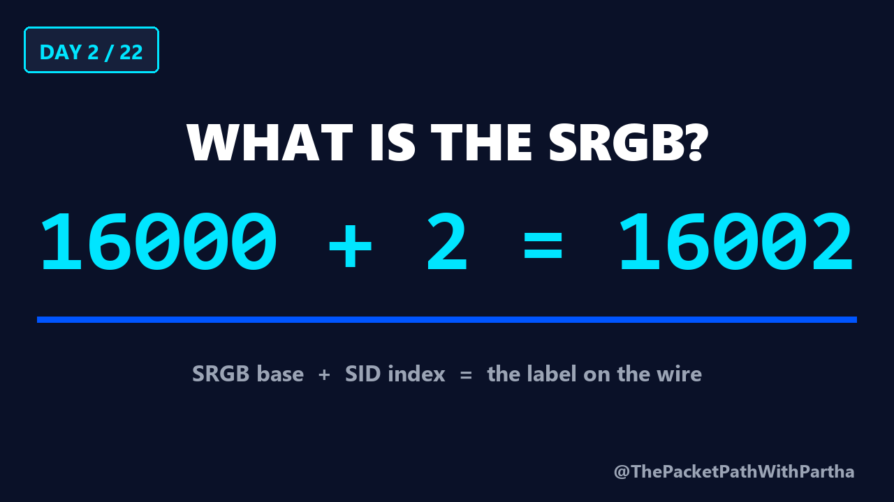
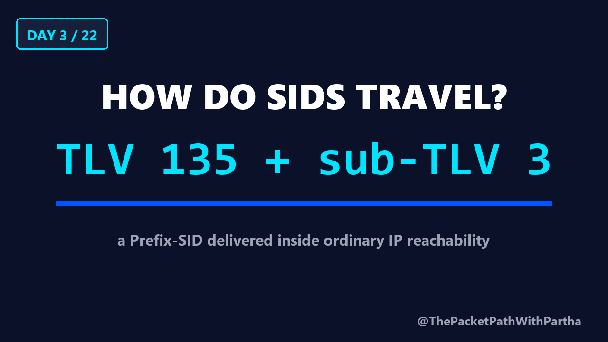
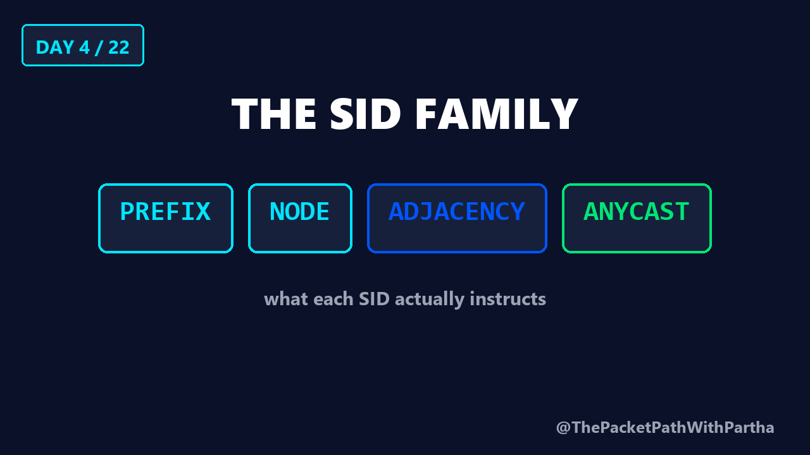
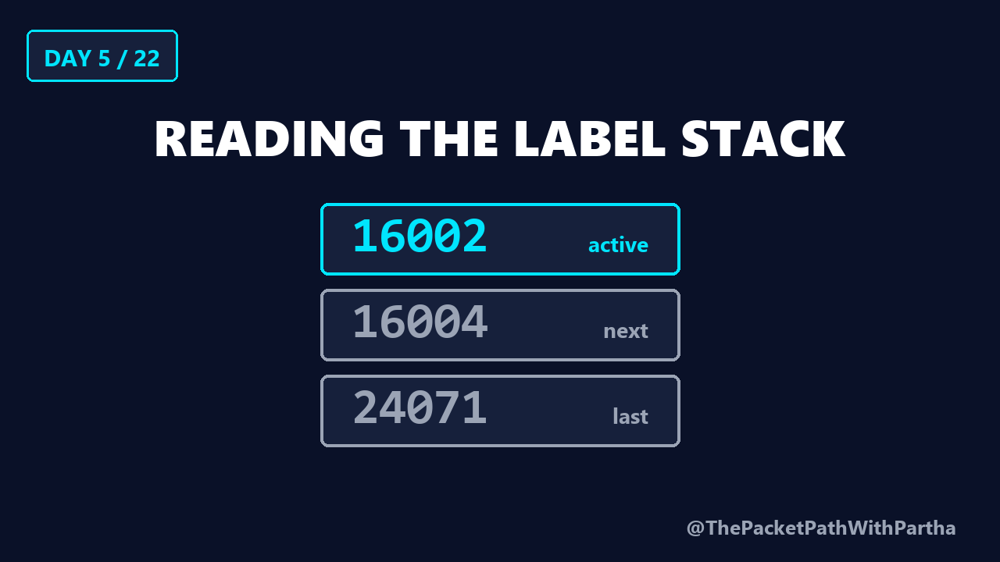
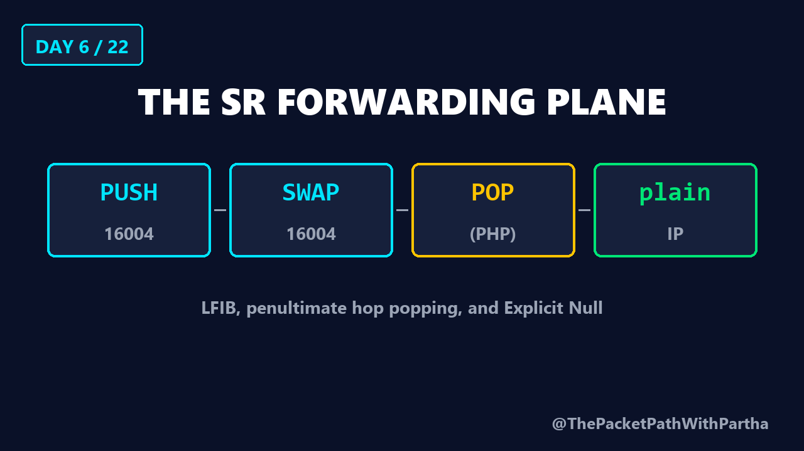
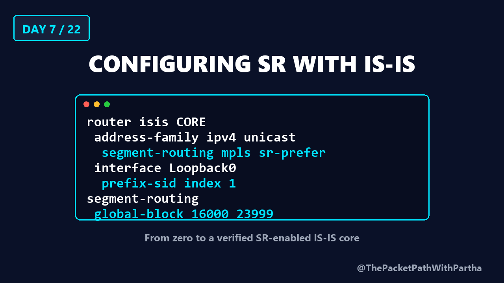
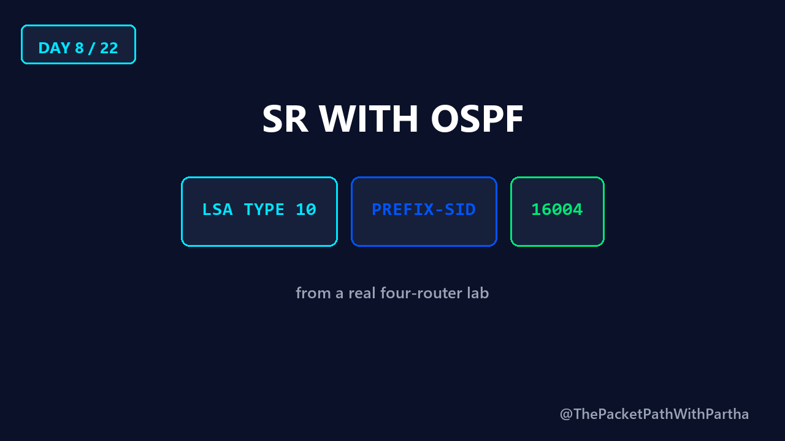
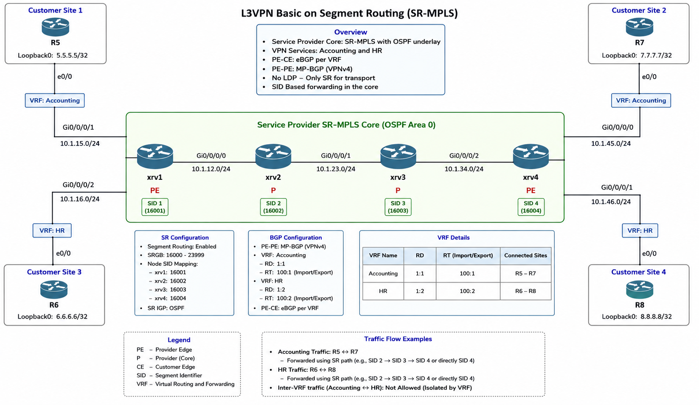

# SR-MPLS Learning Journey

A 22-day video course on **Segment Routing over the MPLS data plane**, taking a
network engineer from *why Segment Routing exists* through to designing,
migrating and troubleshooting a production SR core.

Created and presented by **Enam Ahmed** — [The Packet Path With Partha](https://www.youtube.com/@ThePacketPathWithPartha).

> **Watch on YouTube.** GitHub does not stream video — the files in `videos/`
> download rather than play. The YouTube links below are the intended way to
> watch, and include chapters, captions and the full descriptions.

📺 **[Full playlist →](https://www.youtube.com/playlist?list=PLYQHPRJxy5xk)**
🔔 **[Subscribe →](https://www.youtube.com/@ThePacketPathWithPartha?sub_confirmation=1)**
📘 **[Facebook page →](https://www.facebook.com/ThePacketPathWithPartha)**

---

## Episodes

### Day 1 — Why Segment Routing?
*From protocol complexity to source-routed simplicity*

Why Segment Routing simplifies the MPLS control plane. Contrasts traditional
MPLS using an IGP with LDP and RSVP-TE against the SR-MPLS source-routing
model, and introduces Segment Identifiers, Prefix-SIDs, Adjacency-SIDs, the
head-end concept, and the unchanged MPLS data plane.

▶ [Watch on YouTube](https://www.youtube.com/watch?v=eDqwu6q8Vrc) · 15:22 ·
[`videos/Day01_Why_Segment_Routing.mp4`](videos/Day01_Why_Segment_Routing.mp4)

---

### Day 2 — What Is the SRGB?
*SID index, label arithmetic, and the block every router reserves*

The Segment Routing Global Block, and the arithmetic behind every SR label:

```
label = SRGB base + SID index
16000  +  2       = 16002
```

Covers why LDP's locally-significant labels carry no meaning beyond one link,
the critical distinction between the **globally significant SID index** and the
**locally computed label**, and a walkthrough where one router deliberately uses
a different SRGB base — showing why forwarding still works.

▶ [Watch on YouTube](https://youtu.be/1CZ7QkoUPV0) · 12:24 ·
[`videos/Day02_What_Is_the_SRGB.mp4`](videos/Day02_What_Is_the_SRGB.mp4)



---

### Day 3 — How SIDs Travel
*The IS-IS and OSPF extensions that carry Segment Routing*

How SR capability and SIDs are flooded by the IGP — and why neither IS-IS nor
OSPF needed a redesign to carry them.

**IS-IS carriers**
| Carrier | Sub-TLV |
|---|---|
| Router Capability TLV 242 | SR Capability sub-TLV 2 (the SRGB) |
| Extended IP Reachability TLV 135 | Prefix-SID sub-TLV 3 |
| Extended IS Reachability TLV 22 | Adjacency-SID sub-TLV 31 |
| SID/Label Binding TLV 149 | used by the Mapping Server |

**OSPF carriers**
| Carrier | Contents |
|---|---|
| Router Information Opaque LSA | SR-Algorithm TLV 8, SID/Label Range TLV 9 |
| Extended Prefix Opaque LSA (type 7) | Prefix-SID sub-TLV 2 |
| Extended Link Opaque LSA (type 8) | Adjacency-SID sub-TLV 2 |

▶ [Watch on YouTube](https://youtu.be/FA196yiaYzo) · 12:40 ·
[`videos/Day03_How_Do_SIDs_Travel.mp4`](videos/Day03_How_Do_SIDs_Travel.mp4)



---

### Day 4 — The SID Family
*Prefix, Node, Adjacency and Anycast — what each one instructs*

Four names used almost interchangeably in conversation, and each encoded
differently. A **Prefix-SID** is globally significant and travels as an SRGB
index; an **Adjacency-SID** is locally significant, travels as an absolute
label, and is allocated automatically when an adjacency comes up.

Covers the flag bits with their real IOS XR defaults — **N** (Node-SID, set by
default), **P / NP** (no-PHP), **E** (Explicit-Null, so MPLS EXP/TC bits survive
the final hop) — and how OSPF's different bit layout maps one-to-one onto
IS-IS's.

Closes on the **Anycast-SID**: two routers advertising the same SID on purpose,
giving coarse traffic engineering and automatic failover with no policy change.
The requirement — every node sharing it must use the same SRGB.

▶ [Watch on YouTube](https://youtu.be/NwdrLDNd-60) · 13:26 ·
[`videos/Day04_The_SID_Family.mp4`](videos/Day04_The_SID_Family.mp4)



---

### Day 5 — Reading the Label Stack
*From an intent to an ordered list of instructions*

A single Node-SID gets you the shortest path and nothing more. To control where
traffic actually goes — avoid a link, force a region, guarantee a property — you
need a list of SIDs. This episode builds one, then reads one back off a
captured packet.

The rule behind all of it: **only the top label in a stack is ever active.**
Everything below waits its turn and is popped into place one hop at a time.

```
PE1 must reach PE2 while avoiding P1:

  16002   →  get to P2 (the detour that dodges P1)
  16004   →  then shortest path to PE2
```

Two labels, no per-hop state in the core, nothing signalled. Run in reverse,
a captured stack decodes straight back into the path it encodes — subtract the
SRGB base, and the indexes name the hops. Closes on **Maximum SID Depth**, the
hardware ceiling on how many labels a platform can impose.

▶ [Watch on YouTube](https://youtu.be/wbZUE7HYyp8) · 11:25 ·
[`videos/Day05_Reading_the_Label_Stack.mp4`](videos/Day05_Reading_the_Label_Stack.mp4)



---

### Day 6 — The SR Forwarding Plane
*LFIB, penultimate hop popping, and Explicit Null*

Five days of control-plane theory, and here is the reassuring part: almost
none of it touches the forwarding plane. SR was deliberately designed to leave
the LFIB — and the push/swap/pop every MPLS router already does — alone.

One label, traced end to end. Node4 advertises `1.1.1.4/32` with Prefix-SID
16004, requesting default behaviour:

```
PUSH   at the ingress router
SWAP   at each transit router
POP    at the penultimate hop   (PHP)
```

The packet reaches Node4 as plain IP, with no MPLS lookup at the egress router
at all.

**The trade-off.** PHP saves that lookup, but the label carrying the MPLS
EXP/TC bits is gone before the packet arrives. For a pipe-model QoS design
that depends on those bits surviving the last hop, the **E-flag** requests
Explicit-Null instead — the penultimate hop *swaps* rather than pops, so the
packet arrives still labelled and the marking is intact. One lookup saved
versus QoS bits preserved, and it is worth deciding on purpose.

▶ [Watch on YouTube](https://youtu.be/0Tl8j2QTWUM) · 12:21 ·
[`videos/Day06_The_SR_Forwarding_Plane.mp4`](videos/Day06_The_SR_Forwarding_Plane.mp4)



---

### Day 7 — Configuring SR with IS-IS
*From zero to a verified SR-enabled IS-IS core*

Six days of theory, now turned into a configuration you could type into a
router. The whole surface is smaller than you'd expect: one address-family
command (`segment-routing mpls`), one index per loopback (`prefix-sid
index`), and one global-block declaration for the SRGB. Most of an IS-IS
network — adjacencies, loopbacks, reachability — is already there; this is
the small delta on top of it.

Three commands verify three different layers: `show isis segment-routing
label table` proves the labels were computed, `show mpls forwarding` proves
the LFIB actually programmed them, `show isis database verbose` proves what
got advertised in the first place. Closes on four real places this breaks —
forgetting `metric-style wide`, a non-passive loopback, a duplicate
Prefix-SID index, and a mismatched SRGB.

*Sourcing note: no IS-IS lab capture exists in this project's source
material — every config available is OSPF-based. The CLI shown is standard,
well-documented IOS XR syntax for teaching, not a captured lab output.*

▶ [Watch on YouTube](https://youtu.be/9B0sjZa6Ono) · 11:39 ·
[`videos/Day07_Configuring_SR_with_IS-IS.mp4`](videos/Day07_Configuring_SR_with_IS-IS.mp4)



---

### Day 8 — Configuring SR with OSPF
*The same model, carried by a different IGP*

Yesterday: Segment Routing on IS-IS. Today: OSPF — and the interesting part
isn't how different it is, it's how little changes. Unlike Day 7, this episode
is built entirely on a **real four-router IOS XR lab**: R1–R4 in a line, one
OSPF area, the default SRGB on every router, Prefix-SID indexes 1–4.

Three things OSPF does differently from IS-IS, and everything else is
identical:

- **No `metric-style wide`.** SR rides in Opaque LSAs that already existed.
- **Forwarding is a separate command.** `segment-routing mpls` advertises;
  `segment-routing forwarding mpls` installs what arrives. Miss the second and
  the database looks perfect while nothing forwards.
- **The Prefix-SID lives under the interface, inside the area block.**

The proof, straight from the lab — a traceroute from R1 to R4 shows the **same
label, 16004, at every hop**. Every router computed it from the same SRGB and
the same index. All of it travels in one LSA, Type 10 (the area-scoped
Opaque): the index is advertised, the label is computed locally.

▶ [Watch on YouTube](https://youtu.be/Ugb3zzkQiL8) · 16:59 ·
[`videos/Day08_Configuring_SR_with_OSPF.mp4`](videos/Day08_Configuring_SR_with_OSPF.mp4)



---

## Hands-on labs

Standalone labs that go with the series — full device configs, verification
output, diagrams and write-ups.

### [L3VPN Over SR-MPLS](labs/l3vpn-over-sr-mpls)

Four-router IOS XRv lab proving MPLS L3VPN (VRF/RD/RT/VPNv4 BGP) running on
an SR-MPLS transport instead of LDP — two PEs, two VRFs, full running-configs,
and a traceroute-verified packet walk through the transport and VPN labels.



---

## Coming up

| Day | Topic |
|---|---|
| 9–22 | Mapping Server, LDP migration, SR-TE, TI-LFA, L3VPN/EVPN, troubleshooting |

New lesson every day.

## Who this is for

Network engineers, NOC and IP transport professionals, CCNP and CCIE Service
Provider candidates, and anyone building scalable, programmable networks.

## Format

Every episode is 1080p30, self-narrated, and follows the same structure: learning
outcomes up front, the problem, a practical analogy, an architecture walkthrough,
the benefits and trade-offs, and a three-question knowledge check to close.
